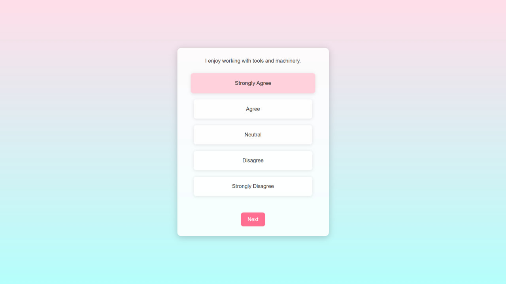
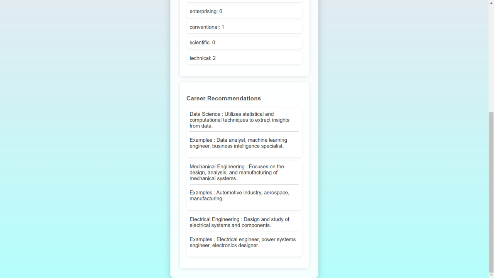

# Student Major Selection System 🎓 

This repository contains a simple **Major Selection System** built using **Django**, which helps students choose a suitable field of study based on their responses to a series of predefined questions.

## Table of Contents  
- [Project Overview](#project-overview)  
- [Features](#features)  
- [Technologies Used](#technologies-used)  
- [How It Works](#how-it-works)  
- [Setup & Installation](#setup--installation)  

## Project Overview  
This web-based application allows users (students) to answer a set of questions related to their interests and skills. Based on their responses, the system **suggests the best-matching major** for them. The recommendation is generated using a simple logic-based scoring system.

## Features  
✔️ User-friendly question-and-answer format  
✔️ Dynamic scoring system for major selection  
✔️ Django-based backend  
✔️ Simple authentication system (optional)  
✔️ Responsive UI 

## Technologies Used  
- **Django** (Backend & Framework)  
- **HTML, CSS, JavaScript** (Frontend)  
- **SQLite** (Database)  

## How It Works  
1. The user starts the test and answers multiple-choice questions.  
2. Each answer has a specific score related to different fields of study.  
3. The system calculates the final score and suggests the **best matching major**.  
4. The user receives a **final recommendation** along with some guidance about the selected field.  

## Screenshots  
### ⁉️ Question Page  
  

### 📃 Result Page  
  


### 🔹Setup & Installation  

1. Clone the repository:  
   ```bash
   git clone https://github.com/Mohammadsajjad-Rahmani/Major-Selection-System.git
2. Install dependencies: pip install -r requirements.txt
3. Run migrations: python manage.py makemigrations & python manage.py migrate
4. Start the server: python manage.py runserver


